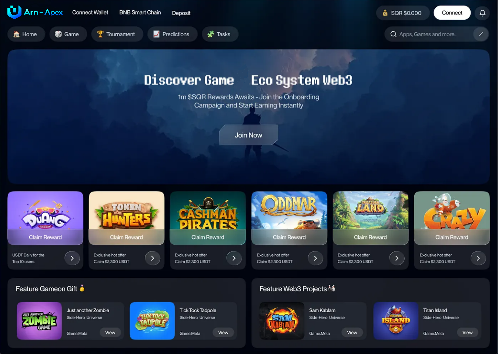
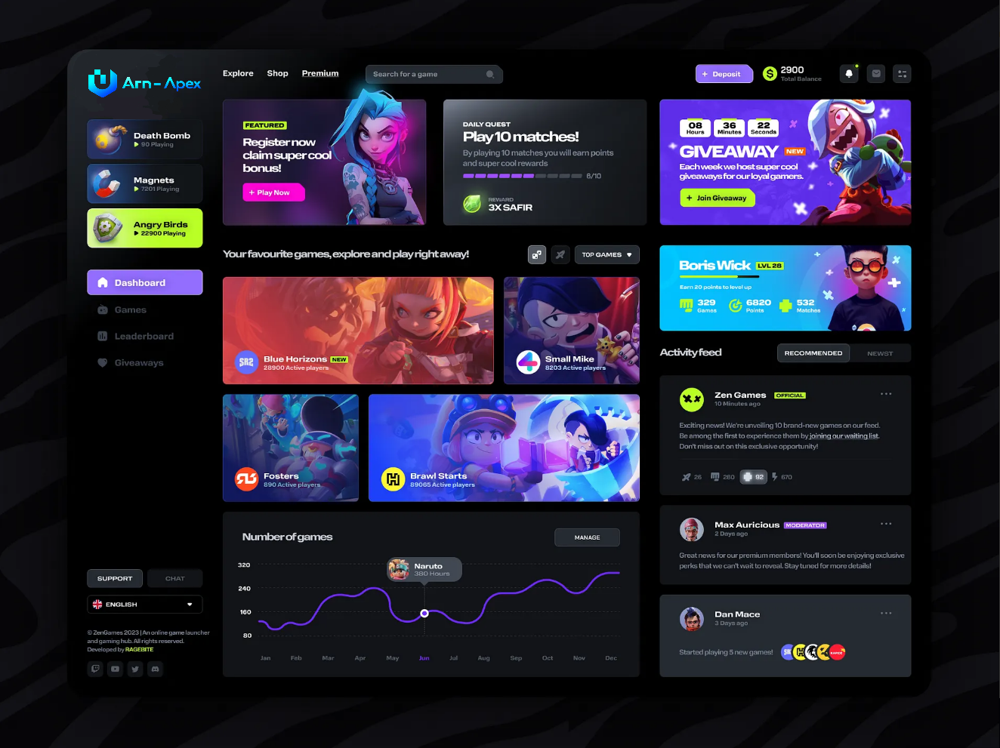
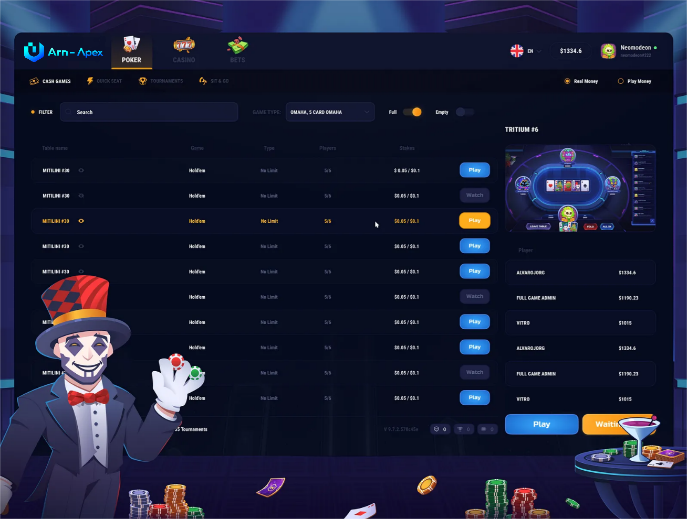

<h1>Arn-Apex Game Hub Platform</h1>

## Overview

**Arn-Apex** is a modern game hub platform designed to bring together gameplay, digital asset trading, and platform services in a single, user-friendly experience. The platform leverages blockchain technology where support asset ownership, transaction.

Players can access **games, trade supported digital assets, manage accounts, and track activity through unified dashboards**. Blockchain is used as an enabling technology rather than a core gameplay mechanic.

## 📸 Platform Screenshots

### GameHub Page

### Dashboard Page

### Game Page(POKER)


---

The current MVP focuses on:

- **Core platform and trading infrastructure**
- **User and asset dashboards**
- **Wallet integration and transaction flows**

  The gameplay layer is intentionally lightweight at this stage and will evolve in future iterations as the platform expands.

## Core Features

- **Game Hub Experience**: A decentralized platform for accessing games, managing accounts, and interacting with player-facing features in one place
- **Digital Asset Trading**: Buy, sell, and trade supported digital assets within the platform
- **Blockchain Integration**: Select on-chain functionality for asset ownership, transaction (used where it adds value, not as a core gameplay mechanic)
- **User Dashboards**: Clear views of balances, activity history, and asset performance
- **Platform Infrastructure**: Modular frontend and backend architecture designed for scalability and future expansion
- **MVP Focus**: Core trading flows and platform foundations, with gameplay and additional features planned for later iterations

## Tech Stack

- **Frontend**: React, TypeScript, TailwindCSS
- **Backend**: Node.js/Nest.js, PostgreSQL/MongoDB, Redis, REST APIs, Python
- **Mobile**: Android, Java, Objective‑C, iOS, Mobile Devices
- **Blockchain**: Solidity, Blockchain, Web3; ERC20/ERC1155/ERC3643 token standards
- **Cloud & DevOps**: AWS, Docker, Terraform, GitHub Actions, CI/CD pipelines
- **Data & Analytics**: TensorFlow, OpenAI
- **Integrations**: Chainlink, KYC/KYB providers
- **Supported Blockchains**: Ethereum, Polygon, Binance Smart Chain (optional: Avalanche, Arbitrum, Base)

## Quick Start

This app requires the following dependancies.

### Prerequisites

- Node.js >= 18 [Node.js](https://nodejs.org/en/download)
- [Git](https://git-scm.com/downloads)
- [VScode](https://code.visualstudio.com/download)

---

### Confirm Installation

```bash
node -v
npm -v
git --version
```

## Run the application
Opens the app and loads the main interface

### Clone

```
git clone https://bitbucket.org/dev_ctrl/arn-apex.git
```

### Install dependencies

```
cd main
npm install
```

### Start the development server

```
npm start
```

view game at [http://localhost:8080](http://localhost:8080)

## License

MIT License

> **Note**  
> This repository represents an MVP and is under active development.  
> APIs, contracts, and features are subject to change.
